# Налаштування середовища розробки Visual Studio Code для створення програм на мові C++ з використанням компілятора GCC С++
**Мета:** Налаштувати середовище розробки Visual Studio Code для створення програм на мові C++ з використанням компілятора GCC С++ (G++)

Відповідно до цієї інструкції ви налаштуєте середовище Visual Studio Code використанням набору компіляторів GCC для створення програм мовою C++ та їх відлагодження програм.

Після налаштування VS Code ви скомпілюєте та налагодите просту програму HelloWorld у VS Code.

## Хід роботи:

**Частина 1 — Налаштування середовища розробки**

**Частина 2 — Написання та відлагодження програм**

**Частина 3 — Завдання для самостійної роботи**

### Частина 1 — Налаштування середовища розробки.
1. Зайдіть на сайт середовища розробки Visual Studio Code (https://code.visualstudio.com) та завантажте його актуальну версію.
2. Встановіть Visual Studio Code. При встановленні поставте мітки:
- відкривати файл у VS Code з контекстного меню
- відкривати папку у VS Code з контекстного меню
- додати VS Code до системних шляхів PATH

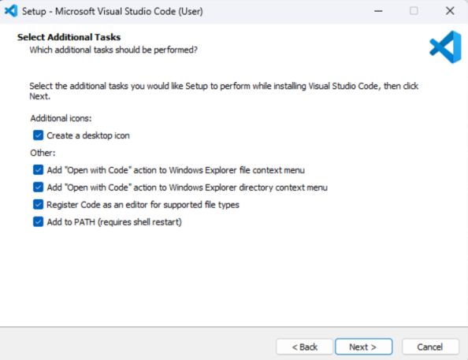

3. Завантажте останню версію MinGW-w64 через MSYS2 (https://www.msys2.org), яка надає актуальні власні збірки GCC, MinGW-w64 та інших корисних інструментів і бібліотек C++. Це надасть вам необхідні інструменти для компіляції вашого коду та його відлагодження.
4. Запустіть інсталятор і виконайте кроки майстра інсталяції. Зауважте, що для MSYS2 потрібна 64-розрядна Windows 8.1 або новіша. 
5. У майстрі виберіть потрібну папку встановлення. Зазвичай приймають рекомендований каталог **C:\msys64**. 

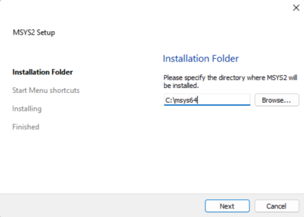

6. Після завершення переконайтеся, що прапорець **«Запустити MSYS2 зараз» (Run MSYS2 now)** позначено, і виберіть **«Завершити» (Finish)**. 

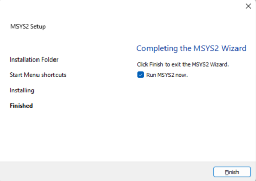

7. Відкриється вікно терміналу MSYS2. 
8. Для оновлення дзеркал репозиторіїв скопіюйте команду `pacman -S pacman-mirrors` і вставте в термінал (комбінацією клавіш **Shift + Ins**) та запустіть її.
9. Потім встановіть набір інструментів MinGW-w64, виконавши команду `pacman -S --needed base-devel mingw-w64-ucrt-x86_64-toolchain`
10. Прийміть стандартну кількість пакетів за замовчуванням, натиснувши клавішу **Enter**

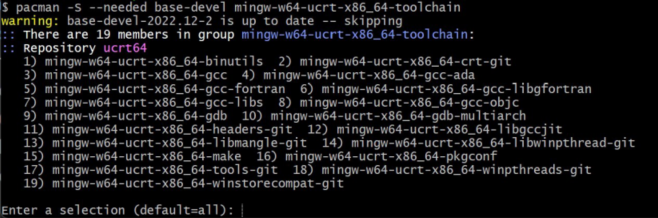

11. Введіть Y, коли буде запропоновано, чи продовжувати встановлення
12. Додайте до змінних середовища (**Environment variables**) шлях до папки **bin** інструментів MinGW-w64, виконавши такі дії:
- У рядку пошуку Windows введіть **Параметри (Settings)**, щоб відкрити налаштування Windows. 
- Знайдіть **Редагувати змінні середовища для свого облікового запису (Edit environment variables for your account)**. 
- У ваших **змінних користувача** виберіть Path змінну, а потім виберіть **Редагувати (Edit)**. 
- Додайте до списку папку призначення MinGW-w64, яку ви записали під час встановлення. Якщо ви використовували параметри за замовчуванням вище, то це буде шлях: **C:\msys64\ucrt64\bin**. 
- Виберіть **OK** , а потім знову натисніть **OK** у вікні **Змінні середовища**, щоб оновити змінні середовища PATH. 
- Якщо у вас на комп’ютері встановлена відмінна від Windows операційна система, скористайтеся відповідною інструкцію, наприклад дляmLinux  https://code.visualstudio.com/docs/cpp/config-linux.
13. Щоб перевірити, чи інструменти MinGW-w64 правильно встановлені та доступні, відкрийте новий командний рядок і введіть:
- `gcc --version`
- `g++ --version`
- `gdb --version`
14. Ви маєте побачити вихідні відомості, які показують встановлені версії GCC, g++ і GDB. Якщо це не так:
- Переконайтеся, що ваш запис змінної PATH відповідає *bin* розташуванню MinGW-w64, де встановлено інструменти. Переконайтеся, що ви виконали попередні інструкції. 
- Якщо не має вихідних відомостей про певні пакети, наприклад gdb, тоді вам потрібно їх встановити. 
15. Установіть **розширення C/C++ для VS Code**. Ви можете встановити розширення C/C++, виконавши пошук за «C++» у вікні **«Розширення» (Extentions)** (комбінацією клавіш Ctrl+Shift+X).

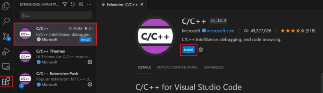

### Частина 2 — Написання та відлагодження програм
16.  Створіть порожню папку під назвою, наприклад, *«projects»*, де ви можете зберігати всі свої проекти VS Code, потім створіть вкладену папку під назвою, наприклад, *«lab1»*, перейдіть до неї та відкрийте VS Code у цій папці через контекстне меню. Поточна папка міститиме вкладену папку *.vscode*, що стане вашим робочим простором.
17.  Натисніть кнопку *«Новий файл»* і назвіть файл, наприклад, **helloworld.cpp**. Створіть вихідний код програми і збережіть його.
```c++
#include <iostream>
#include <vector>
#include <string>
using namespace std;
int main()
{
    vector<string> msg {"Hello", "C++", "World", "from", "VS Code", "and the C++ extension!"};
    for (const string& word : msg)
    {
        cout << word << " ";
    }
    cout << endl;
}
```
18. Відкрийте закладку із файлом *helloworld.cpp*, щоб він був активним.
19. Натисніть кнопку відтворення у верхньому правому куті редактора.

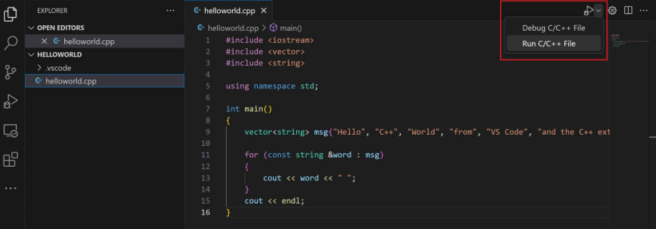

20. Виберіть **активний файл збірки та відлагодження C/C++: g++.exe** зі списку виявлених компіляторів у вашій системі.

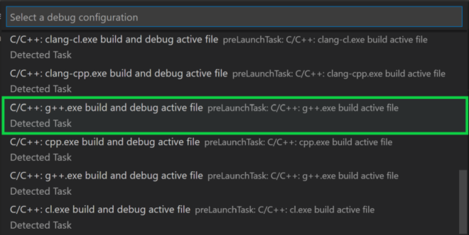

21. Вам буде запропоновано вибрати компілятор лише під час першого запуску *helloworld.cpp*. Цей компілятор буде встановлено як компілятор "за замовчуванням" у *tasks.json* файлі, який зберігає ваші конфігурації збірки. Ваш новий *tasks.json* файл має виглядати схожим на JSON нижче:
```json
{
    "tasks": [
        {
            "type": "cppbuild",
            "label": "C/C++: g++.exe build active file",
            "command": "C:\\msys64\\ucrt64\\bin\\g++.exe",
            "args": [
                "-fdiagnostics-color=always",
                "-g",
                "${file}",
                "-o",
                "${fileDirname}\\${fileBasenameNoExtension}.exe"
            ],
            "options": {
                "cwd": "${fileDirname}"
            },
            "problemMatcher": [
                "$gcc"
            ],
            "group": {
                "kind": "build",
                "isDefault": true
            },
            "detail": "Task generated by Debugger."
        }
    ],
    "version": "2.0.0"
}
```
22. Перейдіть до *helloworld.cpp*, щоб він був активним файлом. Встановіть точку зупинки, клацнувши поле редактора або натиснувши клавішу F9 у поточному рядку.

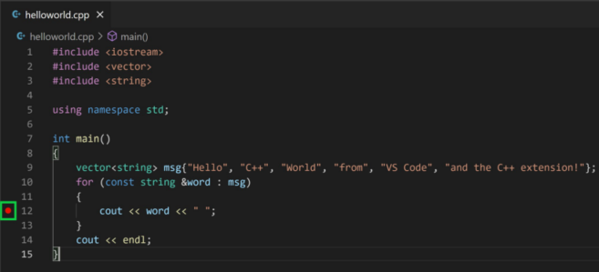

23. У розкривному меню поруч із кнопкою відтворення виберіть Debug C/C++ File. Кнопка відтворення має два режими: **«Запустити файл C/C++» (Run C/C++ File)** і **«Відлагодити файл C/C++» (Debug C/C++ File)**. За замовчуванням буде використовуватися останній режим. Якщо ви бачите піктограму відлагодження на кнопці відтворення, ви можете просто вибрати кнопку відтворення для відлагодження, а не використовувати спадне меню.

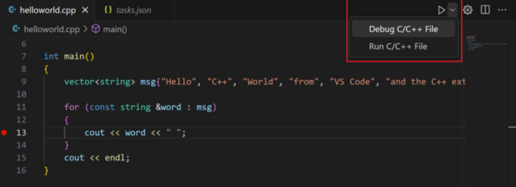

24. Виберіть **активний файл C/C++: g++ build and debug** зі списку виявлених компіляторів у вашій системі (вас попросять вибрати компілятор лише під час першого запуску або відлагодження *helloworld.cpp*). 
25. Редактор підсвічує рядок, де ви встановлюєте точку зупину перед запуском відлагоджувача Інтегрований термінал з’явиться внизу редактора вихідного коду. На вкладці **«Консоль відлагодження»** ви побачите вихідні дані, які вказують на те, що відлагоджувач запущено та він працює.

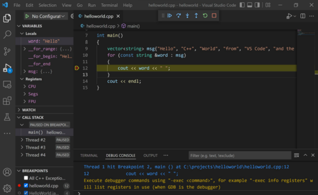

26. У верхній частині редактора коду з’являється панель керування налагодженням.

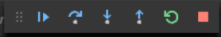

27. Виберіть піктограму **«Перехід» (Step Over)** на панелі керування налагодженням. Це перенесе виконання програми до першого рядка циклу for і пропустить усі внутрішні виклики функцій у класах *vector* і *string*, які викликаються під час msg створення та ініціалізації змінної. Зверніть увагу на зміни у вікні **змінних (Variables)** ліворуч.

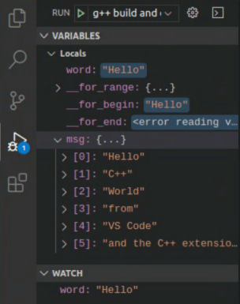

28. Знову натисніть **Step over**, щоб перейти до наступного оператора в цій програмі (пропускаючи весь внутрішній код, який виконується для ініціалізації циклу). Тепер вікно змінних показує інформацію про **змінні** циклу.
29. Якщо хочете, ви можете продовжувати натискати **кнопку Перехід (Continue)**, доки всі слова у векторі не будуть надруковані на консолі. Але якщо вам цікаво, спробуйте натиснути кнопку **Step Into**, щоб пройти через вихідний код у стандартній бібліотеці C++.
30. Вам може знадобитися відстежувати значення змінної під час виконання програми. Ви можете зробити це, встановивши **Спостереження (Watch)** для змінної. Розмістіть точку зупину всередині циклу. У вікні **Watch** виберіть знак плюс і в текстовому полі введіть *word*, що є назвою змінної циклу. Також для цього можна використати контекстне меню **Add to Watch**. Тепер перегляньте вікно спостережень під час проходження циклу.

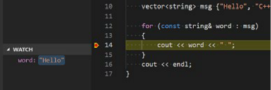

31. Щоб швидко переглянути значення будь-якої змінної, коли виконання призупинено на точці зупину, ви можете навести на неї вказівник миші.

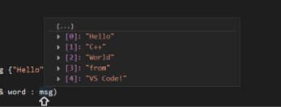

32.Додаткова інформація щодо tasks.json файлів 
- Параметр **command** визначає програму для запуску; в цьому випадку це **g++**.
- Масив **args** визначає аргументи командного рядка, передані **g++**. Ці аргументи перераховані в цьому файлі в певному порядку, очікуваному компілятором. Це завдання вказує **g++** взяти активний файл (`${file}`), скомпілювати його та створити вихідний файл (`-oswitch`) у поточному каталозі (`${fileDirname}`) з такою ж назвою, як і активний файл, але з **.exe** розширенням (`${fileBasenameNoExtension}.exe`). 
- Значення **label** – це те, що ви побачите у списку завдань; ви можете назвати це як завгодно. Значення **detail** – це те, що ви побачите як опис завдання у списку завдань. Рекомендується перейменувати це значення, щоб відрізнити його від подібних завдань. 
- Значення **problemMatcher** вибирає вихідний синтаксичний аналізатор для пошуку помилок і попереджень у виводі компілятора. Для GCC ви отримаєте найкращі результати, якщо скористаєтеся аналізатором `$gcc`. 
- Ви можете визначити кілька завдань збірки в **tasks.json**, і будь-яке завдання, позначене як типове, використовуватиметься за замовчуванням. 
- Якщо вам потрібно змінити компілятор за замовчуванням, ви можете запустити **Tasks: Configure Default Build Task** на панелі команд.
- Ви можете змінити свій, **tasks.json** щоб створити кілька файлів C++, використовуючи такий аргумент, як `"${workspaceFolder}/*.cpp"` замість `"${file}"`. Це створить усі **.cpp** файли у вашій поточній папці. 
- Ви також можете змінити назву вихідного файлу, замінивши `"${fileDirname}\\${fileBasenameNoExtension}.exe"` її назвою файлу, наприклад `"${workspaceFolder}\\myProgram.exe"`.

### Частина 3 — Завдання для самостійної роботи

33. Встановіть і налаштуйте середовище розробки Visual Studio Code для створення програм на мові C++ з використанням компілятора GCC С++.
34. Напишіть та відлагодьте свою першу програму. Модифікуйте її,mдослідіть інструменти відлагоджування.
35. Напишіть конструктивні висновки щодо цієї роботи. Що ви дізналися нового? Що ви вже знайомо із попереднього курсу «Програмування на мові С»? Яке призначення мають інструменти середовища розробки VS Code.

### Посилання
1. Configure VS Code for Microsoft C++ https://code.visualstudio.com/docs/cpp/config-msvc
2. Using GCC with MinGW https://code.visualstudio.com/docs/cpp/config-mingw
3. MSYS2 Getting Started 
4. MSYS2 https://packages.msys2.org/package/pacman-mirrors?repo=msys&variant=x86_64
5. Using C++ on Linux in VS Code https://code.visualstudio.com/docs/cpp/config-linux
